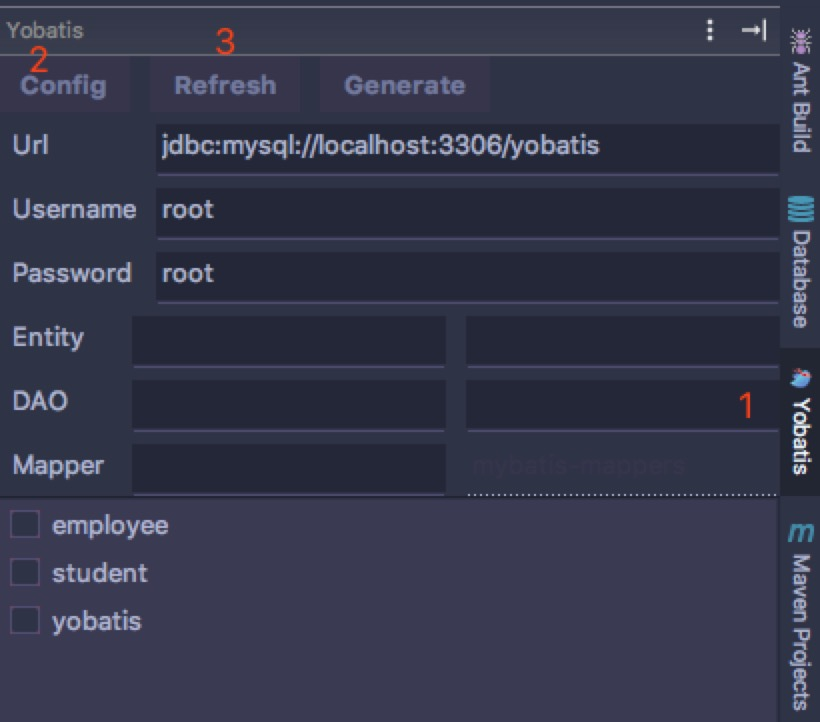
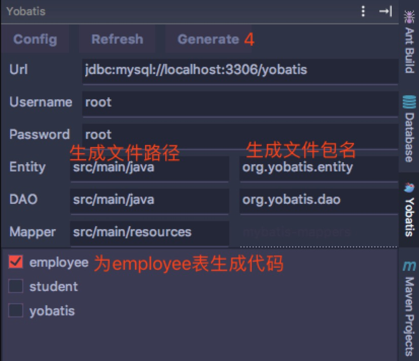
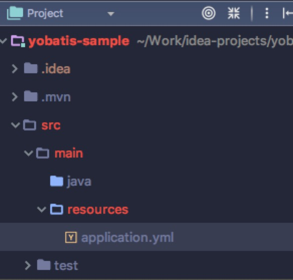
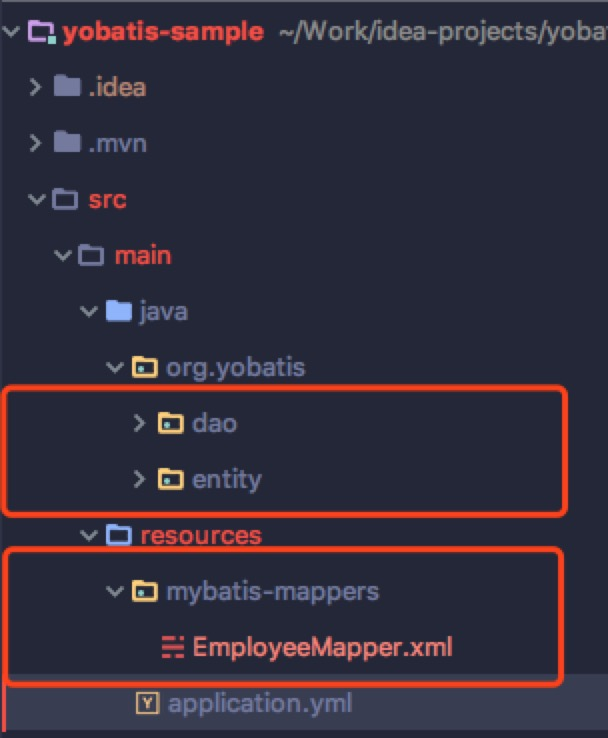

# Note
该项目仅供说明，源码请访问 https://github.com/linbaiye/yobatis-core (核心，本来是支持IDEA和Eclipse) & IDEA UI: https://github.com/linbaiye/yobatis-idea

# Yobatis简介

Yobatis是一款基于MybatisGenerator的IDEA插件，在MG的基础上二次开发和封装，快速生成基础的CURD方法；表结构发生变更只需要重新生成即可，Yobatis会保留dao层中手写的方法和xml中自定义的tag。<br> 
插件以Tool Window的形式呈现，只需要简单配置好数据库和文件生成路径即可: <br>


<br>
按照上图配置好单击Generate就可以生成代码:<br>
 ----->

<br>
<br>
详细介绍请访问Yobatis使用手册：https://linbaiye.github.io/yobatis-tour/


## 使用生成代码:
生成代码使用简单，假设Yobatis为表 create table employee(id bigint primary key auto_increment, name char(20), phone char(12)) 生成代码，下面是2个查询示例:

```
// 通过条件查询：select id, name, phone from emloyee where name = 'Alice' and phone is not null
List<Employee> list = employeeDao.selectList(EmployeeCriteria.nameEqualTo("Alice").andPhoneIsNotNull());
// 该方法不会返回null
for (Employee employee : list) {
  System.out.println(employee.toString());
}
```

```
// select id, name, phone from emloyee where id = 1;
Employee employee = employeeDao.selectOne(1L);
if (employee == null) {
  System.out.println('没有id为1的员工.');
} else {
  System.out.println('员工的信息为:' + employee.toString());
}
```
示例项目: https://github.com/linbaiye/yobatis-sample.git
## 安装
Yobatis当前只支持本地安装，请下载最新release并通过本地安装方式安装即可。
* 当前只支持Mysql
* java8+
* idea 144.3600.7+ (15年中以后的release应该都可以)


